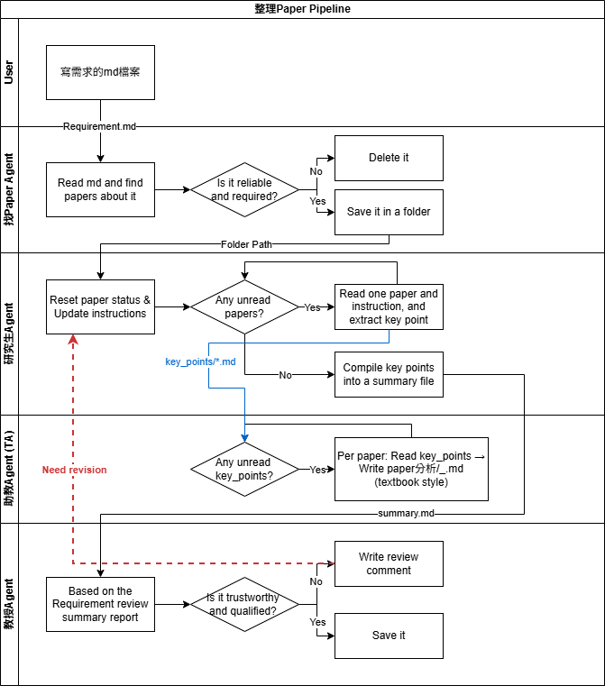

# Paper Pipeline

一個自動化的文獻整理系統，使用 [Claude Code CLI](https://docs.claude.com/en/docs/agents-and-tools/claude-code/overview) 作為 agent runtime。四個專業 agent —— Paper Finder、Grad Student、TA、Professor —— 分工合作找 paper、抽 key points、寫教學文、產出經過審查的 literature review。

## 為什麼建這個

目前 LLM 輔助文獻 review 工具的兩種典型問題：
1. 直接吐出綜合性的散文，無法追溯來源
2. 一篇一篇讀 paper 但沒有跨 paper 的整合

本 pipeline 把職責拆成四個 agent，每個只負責一件事，agent 之間只透過檔案系統溝通。每個中間狀態都可觀察（直接看檔案就行），每一步都可重啟，Grad Student 與 Professor 之間的退件迴圈模擬真實的學術同儕審查。

## 架構圖



> 若上圖未顯示「**助教Agent (TA)**」lane，代表 PNG 尚未更新到最新版。請開 [draw.io](https://app.diagrams.net/) 載入 `讀Paper的PipeLine.drawio`，File → Export As → PNG 重新匯出覆蓋既有檔。

## 流程文字版

```
[User] → Requirement.md
    ↓
[Paper Finder Agent] → 從 arXiv + Semantic Scholar (+ 可選 Google Scholar) 搜尋
    ↓                   評分並下載前 N 篇 PDF
papers/_inbox/
    ↓ (orchestrator 把 PDF 搬到 _reading)
[Grad Student Agent] (Phase 1，每篇 paper 一個全新 session)
    ↓                   按 IMRD 順序讀 PDF，抽取結構化 key points
key_points/paper_*.md
    ↓
[TA Agent] (每篇 paper 一個全新 session)
    ↓                   把 IMRD key points 改寫成 textbook 風格教學文
paper分析/paper_*_<Method>.md
    ↓
[Grad Student Agent] (Phase 2)
    ↓                   把所有 key points 統整成 summary
summaries/v1.md
    ↓
[Professor Agent]
    ↓                   依 rubric 審查；≥75 通過，否則退件
final/summary_final.md       OR    summaries/v1_review.md → 退回 Phase 2 (v2, v3)
```

每次 agent 呼叫都是**全新的 Claude Code 子程序**（沒有 session history）。Agent 之間的 state 只透過檔案傳遞。Orchestrator (`run.py`) 負責流程控制、檔案搬移、退件迴圈邏輯。

## 環境需求

- Python 3.10+
- [Claude Code CLI](https://docs.claude.com/en/docs/agents-and-tools/claude-code/overview)（裝好且登入）
- Anthropic 訂閱（agent 透過 Claude Code 跑，環境內不需要 API key）

## 安裝

```bash
git clone https://github.com/TyrannosaurusR/Paper-pipeline.git
cd Paper-pipeline
python -m venv .venv
source .venv/bin/activate          # macOS / Linux
# .venv\Scripts\Activate.ps1       # Windows PowerShell
pip install -r requirements.txt
```

## 使用方式

1. 複製 template 建立新題目：
   ```bash
   cp -r projects/_template projects/my-topic
   ```

2. 編輯 `projects/my-topic/Requirement.md`，填好 8 個欄位（research questions、keywords、scope、exclusions、acceptance criteria 等）。

3. 跑 pipeline：
   ```bash
   # 測試（2 篇 paper，~30 分鐘）
   python run.py my-topic --max-papers 2

   # 正式（10 篇 paper，~2 小時）
   python run.py my-topic
   ```

4. 讀產出：`projects/my-topic/final/summary_final.md` 是通過審查的 review；`projects/my-topic/paper分析/*.md` 是每篇 paper 的教學文。

### 中斷後續跑

```bash
python run.py my-topic --skip-finder       # 跳過 paper 搜尋，重用既有 _inbox/
python run.py my-topic --resume-from 5     # 從 step 5 (TA) 開始
```

Step 對照：1=validate, 2=paper finder, 3=move to reading, 4=Grad Student Phase 1, 5=TA, 6=Grad Student Phase 2, 7=Professor。

## 客製化

- **改 agent 行為**：編輯對應的 `agents/<name>/agent.md`。每個是 YAML frontmatter（name、model、tools）+ 結構化 Markdown body（role、mission、rules、workflow、output format）。
- **換 model**：改 `run.py` 上方的 `MODEL = "claude-sonnet-4-6"`。
- **改退件次數上限**：改 `MAX_REVISIONS = 2`（教授最多退件幾次後強制收件）。
- **改 paper 數量上限**：改 `MAX_PAPERS = 10`（Paper Finder 預設找幾篇）。

## 產出格式

完成的題目資料夾結構：

```
projects/my-topic/
├── Requirement.md                  user 寫的研究需求
├── papers/_done/*.pdf              已下載的 paper
├── papers/_inbox/metadata.json     搜尋結果與評分
├── papers/_rejected/rejected.json  被刷掉的 paper
├── key_points/paper_*.md           IMRD 格式抽取（每篇 paper 一份）
├── paper分析/paper_*.md            教學文（每篇 paper 一份）
├── summaries/v1.md, v1_review.md, v2.md, ...   統整 + 退件迴圈歷史
└── final/summary_final.md          通過審查的最終版
```

`paper分析/` 預設用繁體中文寫，因為 TA agent 的 prompt 指定中文教學風格。要換語言改 `agents/ta/agent.md`。

## 成本

跑在 Claude 訂閱（Pro / Team）上，一次 10 篇 paper 的 pipeline 約 2 小時 wall-clock，會佔 quota 數百到數千條 message。**訂閱以外不會有額外的 API 費用**。

## 限制

- **只支援單 agent 文獻 review**，沒有多角度綜合或對立觀點。
- **PDF 抽取依賴 Claude 的 vision 能力**，複雜的圖表可能被誤讀。
- **Paper Finder 用 ad-hoc 的 Python 腳本**（agent 每次跑時自己生）做搜尋，不是固定的 retrieval system，結果會有浮動。
- **教授的 rubric 寫死在 `agents/professor/agent.md`**，要改評分標準直接改那檔。
- **`papers/_done/` 的 PDF 在 public repo 不追蹤**。如果你 fork 後想追蹤研究資料，改 `.gitignore`。

## 授權

MIT，見 `LICENSE`。

## Contributing

這是個人為了重複利用而 share 的專案。Issue 與 PR 歡迎但回覆時間不保證。
